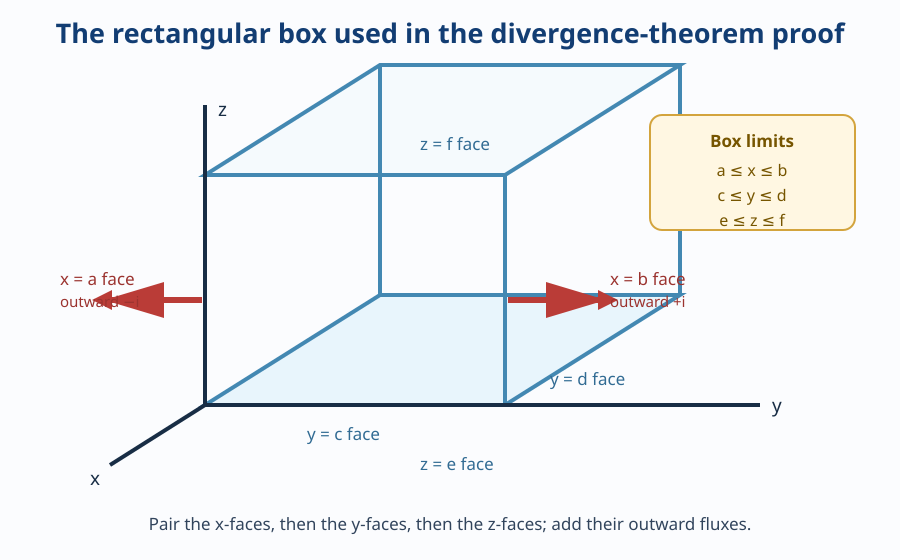
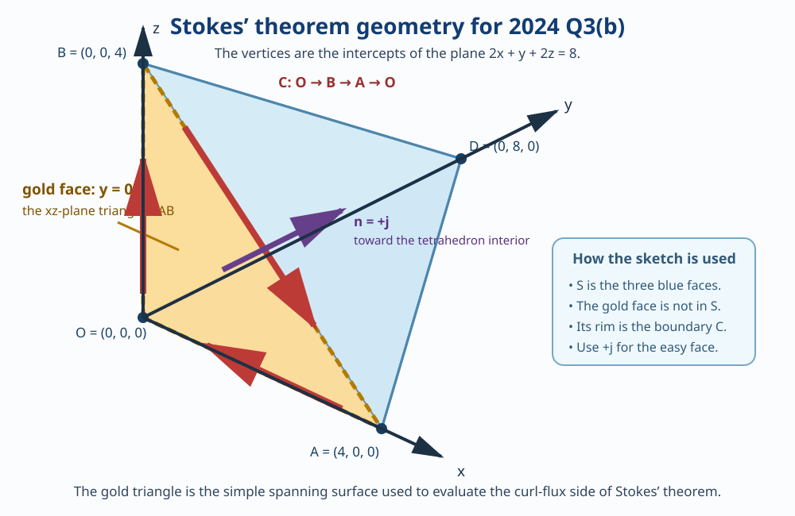

# 2024 Q3 Study Guide

Read the new material in [Divergence theorem and Stokes’ theorem](../concepts/divergence-and-integral-theorems.md) first. It links to the earlier notes for curl, flux, normals, and line integrals, so this guide does not repeat them.

---

## Q3(a): State and prove divergence theorem

**Question.** State and prove divergence theorem.

### Underlying-concept map

1. **Divergence:** local source or sink strength, measured by \(\nabla\cdot\vec F\).
2. **Closed surface:** a complete shell around a volume, with outward normal.
3. **Flux:** the total field passing outward through that shell.
4. **Fundamental Theorem of Calculus:** turns the difference of a field component on two opposite faces into an integral of its partial derivative between them.
5. **Internal cancellation:** when many tiny boxes fill a solid, their shared-face fluxes cancel.

### Solve it yourself

1. Write the theorem with its hypotheses: closed surface, outward normal, enclosed volume, and continuous first partial derivatives.
2. Begin with a rectangular box and calculate flux through the two \(x\)-faces.
3. Use the Fundamental Theorem of Calculus to express that as a triple integral of \(P_x\).
4. State the two corresponding results for the \(y\)- and \(z\)-faces.
5. Add all three and explain the tiny-box cancellation for a general solid.

### Detailed answer

Let

\[
\vec F=P\hat i+Q\hat j+R\hat k.
\]

Let \(S\) be a closed, piecewise smooth surface enclosing a volume \(V\), and let \(\hat n\) be the outward unit normal. Suppose \(P,Q,R\) have continuous first partial derivatives on and inside \(S\).

> [!IMPORTANT]
> **Divergence theorem**
>
> \[
> \boxed{\iint_S\vec F\cdot\hat n\,dS
> =\iiint_V\nabla\cdot\vec F\,dV.}
> \]
>
> Equivalently,
>
> \[
> \iint_S\vec F\cdot\hat n\,dS
> =\iiint_V\left(\frac{\partial P}{\partial x}+\frac{\partial Q}{\partial y}+\frac{\partial R}{\partial z}\right)dV.
> \]

### Proof for a rectangular box

Take

\[
V=[a,b]\times[c,d]\times[e,f].
\]

> [!NOTE]
> **Notation — what this box description means**
>
> \([a,b]\) means every \(x\)-value from \(a\) to \(b\), including both endpoints. The multiplication sign \(\times\) means “combine the three allowed coordinate ranges.” Thus \(V\) is the complete rectangular solid made of all points \((x,y,z)\) satisfying
>
> \[
> a\le x\le b,\qquad c\le y\le d,\qquad e\le z\le f.
> \]
>
> The letters \(a,c,e\) name the lower coordinate bounds; \(b,d,f\) name the corresponding upper bounds. This is a box, not multiplication of three ordinary numbers.

*Use this sketch while reading the proof: the two faces with the same coordinate letter are the pair whose fluxes are combined.*

First calculate the flux through the faces \(x=b\) and \(x=a\). Their outward normals are \(+\hat i\) and \(-\hat i\), respectively.

On \(x=b\),

\[
\vec F\cdot\hat n=\vec F\cdot\hat i=P(b,y,z).
\]

On \(x=a\),

\[
\vec F\cdot\hat n=\vec F\cdot(-\hat i)=-P(a,y,z).
\]

So the combined flux through those two faces is

\[
\begin{aligned}
\Phi_x
&=\int_e^f\int_c^dP(b,y,z)\,dy\,dz
+\int_e^f\int_c^d[-P(a,y,z)]\,dy\,dz\\
&=\int_e^f\int_c^d\big[P(b,y,z)-P(a,y,z)\big]dy\,dz\\
&=\int_e^f\int_c^d\left[\int_a^b\frac{\partial P}{\partial x}\,dx\right]dy\,dz
&&\text{[Fundamental Theorem of Calculus: \(\int_a^b f'(x)\,dx=f(b)-f(a)\)]}\\
&=\int_e^f\int_c^d\int_a^b\frac{\partial P}{\partial x}\,dx\,dy\,dz\\
&=\iiint_V\frac{\partial P}{\partial x}\,dV.
\end{aligned}
\]

Now calculate the \(y\)-face pair. On \(y=d\), the outward normal is \(+\hat j\); on \(y=c\), it is \(-\hat j\):

\[
\begin{aligned}
\Phi_y
&=\int_e^f\int_a^bQ(x,d,z)\,dx\,dz
+\int_e^f\int_a^b[-Q(x,c,z)]\,dx\,dz\\
&=\int_e^f\int_a^b\big[Q(x,d,z)-Q(x,c,z)\big]dx\,dz\\
&=\int_e^f\int_a^b\left[\int_c^d\frac{\partial Q}{\partial y}\,dy\right]dx\,dz
&&\text{[Fundamental Theorem of Calculus: \(\int_c^d f'(y)\,dy=f(d)-f(c)\)]}\\
&=\int_e^f\int_a^b\int_c^d\frac{\partial Q}{\partial y}\,dy\,dx\,dz\\
&=\iiint_V\frac{\partial Q}{\partial y}\,dV.
\end{aligned}
\]

Finally calculate the \(z\)-face pair. On \(z=f\), the outward normal is \(+\hat k\); on \(z=e\), it is \(-\hat k\):

\[
\begin{aligned}
\Phi_z
&=\int_c^d\int_a^bR(x,y,f)\,dx\,dy
+\int_c^d\int_a^b[-R(x,y,e)]\,dx\,dy\\
&=\int_c^d\int_a^b\big[R(x,y,f)-R(x,y,e)\big]dx\,dy\\
&=\int_c^d\int_a^b\left[\int_e^f\frac{\partial R}{\partial z}\,dz\right]dx\,dy
&&\text{[Fundamental Theorem of Calculus: \(\int_e^f G'(z)\,dz=G(f)-G(e)\)]}\\
&=\int_c^d\int_a^b\int_e^f\frac{\partial R}{\partial z}\,dz\,dx\,dy\\
&=\iiint_V\frac{\partial R}{\partial z}\,dV.
\end{aligned}
\]

The total outward flux through all six faces is

\[
\begin{aligned}
\iint_S\vec F\cdot\hat n\,dS
&=\Phi_x+\Phi_y+\Phi_z\\
&=\iiint_V\frac{\partial P}{\partial x}\,dV
+\iiint_V\frac{\partial Q}{\partial y}\,dV
+\iiint_V\frac{\partial R}{\partial z}\,dV\\
&=\iiint_V\left(\frac{\partial P}{\partial x}+\frac{\partial Q}{\partial y}+\frac{\partial R}{\partial z}\right)dV\\
&=\iiint_V(\nabla\cdot\vec F)\,dV.
\end{aligned}
\]

Thus the theorem is proved for a rectangular box.

### Extension to a general closed surface

Divide a general solid into many tiny boxes. Every internal face belongs to two neighboring boxes. Its outward normal for one box is the inward normal for the other, so the two flux contributions are equal in size and opposite in sign. They cancel. Only the outer faces survive. As the boxes become arbitrarily small, their total becomes the flux through the original closed surface and the sum of their inside divergences becomes the triple integral. Therefore the same formula holds for the general closed surface.

\[
\boxed{\iint_S\vec F\cdot\hat n\,dS=\iiint_V(\nabla\cdot\vec F)\,dV.}
\]

---

## Q3(b): Verify Stokes’ theorem

**Question.** Verify Stoke’s theorem for \(\vec F=xz\hat i-y\hat j+x^2yz\hat k\), where \(s\) is the surface of the region bounded by \(x=0,y=0,z=0,2x+y+2z=8\) which is not included in the \(xz\) plane.

### Underlying-concept map

1. **Stokes’ theorem:** circulation around a boundary equals curl flux through a spanning surface.
2. **The omitted face:** “not included in the \(xz\) plane” means omit the face \(y=0\); its triangular rim is the boundary \(C\).
3. **Orientation:** the remaining outward-oriented faces induce the same boundary orientation as the omitted face with normal toward positive \(y\).
4. **Curl:** use the existing curl formula from the Q2 concept note.
5. **Line integral:** add the contributions from the three directed boundary edges.
6. **Surface integral:** use the easy triangular face \(y=0\), which has the same boundary.

### Solve it yourself

1. Find the three vertices of the triangular face \(y=0\).
2. Take its compatible normal toward positive \(y\), and traverse the triangle \(O\to B\to A\to O\).
3. Find \(\nabla\times\vec F\).
4. Calculate \(\int_C\vec F\cdot d\vec r\) on each of the three edges, then add them.
5. Set \(y=0\) in the curl, dot it with \(+\hat j\), and integrate it over the triangle.
6. Confirm that both sides agree.

### Detailed solution

Stokes’ theorem says

\[
\oint_C\vec F\cdot d\vec r
=\iint_S(\nabla\times\vec F)\cdot\hat n\,dS.
\]

The phrase “not included in the \(xz\) plane” means that the face \(y=0\) is missing from the tetrahedron. Its edges form the boundary curve \(C\).

On \(y=0\), the plane equation becomes

\[
\begin{aligned}
2x+y+2z&=8,\\
2x+0+2z&=8,\\
2x+2z&=8,\\
x+z&=4.
\end{aligned}
\]

The triangle has vertices

\[
O=(0,0,0),\qquad A=(4,0,0),\qquad B=(0,0,4).
\]

Use the normal \(\hat n=+\hat j\). The compatible boundary direction is

\[
O\longrightarrow B\longrightarrow A\longrightarrow O.
\]

Write the field components as

\[
P=xz,\qquad Q=-y,\qquad R=x^2yz.
\]

Calculate curl:

\[
\begin{aligned}
\nabla\times\vec F
&=\left(\frac{\partial R}{\partial y}-\frac{\partial Q}{\partial z}\right)\hat i
+\left(\frac{\partial P}{\partial z}-\frac{\partial R}{\partial x}\right)\hat j
+\left(\frac{\partial Q}{\partial x}-\frac{\partial P}{\partial y}\right)\hat k\\
&=\left(\frac{\partial(x^2yz)}{\partial y}-\frac{\partial(-y)}{\partial z}\right)\hat i
+\left(\frac{\partial(xz)}{\partial z}-\frac{\partial(x^2yz)}{\partial x}\right)\hat j
+\left(\frac{\partial(-y)}{\partial x}-\frac{\partial(xz)}{\partial y}\right)\hat k\\
&=(x^2z-0)\hat i+(x-2xyz)\hat j+(0-0)\hat k\\
&=x^2z\hat i+(x-2xyz)\hat j.
\end{aligned}
\]

### Left side: line integral around the boundary

The boundary has three edges. Calculate each separately.

#### Edge 1: \(O\to B\)

Parameterize the edge:

\[
\vec r_1(t)=\langle0,0,t\rangle,
\qquad 0\le t\le4.
\]

Then

\[
d\vec r_1=\langle0,0,1\rangle\,dt.
\]

On this edge, \(x=0\), \(y=0\), and \(z=t\), so

\[
\begin{aligned}
\vec F(\vec r_1(t))
&=\langle xz,-y,x^2yz\rangle\\
&=\langle(0)(t),-0,(0)^2(0)(t)\rangle\\
&=\langle0,0,0\rangle.
\end{aligned}
\]

Thus

\[
\begin{aligned}
\int_{C_1}\vec F\cdot d\vec r
&=\int_0^4\langle0,0,0\rangle\cdot\langle0,0,1\rangle\,dt\\
&=\int_0^4[0(0)+0(0)+0(1)]\,dt\\
&=\int_0^40\,dt\\
&=0.
\end{aligned}
\]

#### Edge 2: \(B\to A\)

Use \(x=t\). Along this straight edge, \(y=0\) and \(x+z=4\), so \(z=4-t\):

\[
\vec r_2(t)=\langle t,0,4-t\rangle,
\qquad0\le t\le4.
\]

Differentiate each coordinate:

\[
d\vec r_2=\langle1,0,-1\rangle\,dt.
\]

Substitute \(x=t\), \(y=0\), and \(z=4-t\) into the field:

\[
\begin{aligned}
\vec F(\vec r_2(t))
&=\langle xz,-y,x^2yz\rangle\\
&=\langle t(4-t),-0,t^2(0)(4-t)\rangle\\
&=\langle4t-t^2,0,0\rangle.
\end{aligned}
\]

Now calculate the dot product:

\[
\begin{aligned}
\vec F(\vec r_2(t))\cdot d\vec r_2
&=\langle4t-t^2,0,0\rangle\cdot\langle1,0,-1\rangle\,dt\\
&=[(4t-t^2)(1)+0(0)+0(-1)]\,dt\\
&=(4t-t^2)\,dt.
\end{aligned}
\]

Therefore

\[
\begin{aligned}
\int_{C_2}\vec F\cdot d\vec r
&=\int_0^4(4t-t^2)\,dt\\
&=\left[\frac{4t^2}{2}-\frac{t^3}{3}\right]_{t=0}^{t=4}
&&\text{[Power rule: \(\int t^n\,dt=t^{n+1}/(n+1)+C\), \(n\ne-1\)]}\\
&=\left[\frac{4(4)^2}{2}-\frac{(4)^3}{3}\right]-\left[\frac{4(0)^2}{2}-\frac{(0)^3}{3}\right]\\
&=\left[\frac{4(16)}2-\frac{64}{3}\right]-0\\
&=\frac{64}{2}-\frac{64}{3}\\
&=32-\frac{64}{3}\\
&=\frac{96}{3}-\frac{64}{3}\\
&=\frac{32}{3}.
\end{aligned}
\]

#### Edge 3: \(A\to O\)

Use \(x=t\), but let \(t\) decrease from 4 to 0 so that the direction is \(A\to O\):

\[
\vec r_3(t)=\langle t,0,0\rangle,
\qquad4\ge t\ge0.
\]

Then

\[
d\vec r_3=\langle1,0,0\rangle\,dt.
\]

On this edge, \(y=0\) and \(z=0\), so

\[
\begin{aligned}
\vec F(\vec r_3(t))
&=\langle xz,-y,x^2yz\rangle\\
&=\langle(t)(0),-0,t^2(0)(0)\rangle\\
&=\langle0,0,0\rangle.
\end{aligned}
\]

Therefore

\[
\begin{aligned}
\int_{C_3}\vec F\cdot d\vec r
&=\int_4^0\langle0,0,0\rangle\cdot\langle1,0,0\rangle\,dt\\
&=\int_4^00\,dt\\
&=0.
\end{aligned}
\]

Add the three directed edges:

\[
\begin{aligned}
\oint_C\vec F\cdot d\vec r
&=\int_{C_1}\vec F\cdot d\vec r+\int_{C_2}\vec F\cdot d\vec r+\int_{C_3}\vec F\cdot d\vec r\\
&=0+\frac{32}{3}+0\\
&=\frac{32}{3}.
\end{aligned}
\]

### Right side: curl flux through the simple triangular face

Use the missing face \(y=0\), with compatible normal \(\hat n=+\hat j\). On that face,

\[
\begin{aligned}
(\nabla\times\vec F)\cdot\hat n
&=\left\langle x^2z,x-2xyz,0\right\rangle\cdot\langle0,1,0\rangle\\
&=x^2z(0)+(x-2xyz)(1)+0(0)\\
&=x-2xyz.
\end{aligned}
\]

Because \(y=0\) on the face,

\[
\begin{aligned}
x-2xyz
&=x-2x(0)z\\
&=x-0\\
&=x.
\end{aligned}
\]

The triangular region is \(x\ge0\), \(z\ge0\), and \(x+z\le4\). Choose \(x\) as the outside variable:

\[
0\le x\le4,
\qquad
0\le z\le4-x.
\]

Since the face is the coordinate plane \(y=0\), its area element is \(dS=dz\,dx\). Therefore

\[
\begin{aligned}
\iint_S(\nabla\times\vec F)\cdot\hat n\,dS
&=\int_0^4\int_0^{4-x}x\,dz\,dx\\
&=\int_0^4\left[xz\right]_{z=0}^{z=4-x}\,dx
&&\text{[Constant rule: \(\int c\,dz=cz+C\) when \(c\) is constant with respect to \(z\)]}\\
&=\int_0^4\left[x(4-x)-x(0)\right]dx\\
&=\int_0^4(4x-x^2)\,dx\\
&=\left[\frac{4x^2}{2}-\frac{x^3}{3}\right]_{x=0}^{x=4}
&&\text{[Power rule: \(\int x^n\,dx=x^{n+1}/(n+1)+C\), \(n\ne-1\)]}\\
&=\left[\frac{4(4)^2}{2}-\frac{(4)^3}{3}\right]-0\\
&=\frac{64}{2}-\frac{64}{3}\\
&=32-\frac{64}{3}\\
&=\frac{96}{3}-\frac{64}{3}\\
&=\frac{32}{3}.
\end{aligned}
\]

Both sides are equal:

\[
\boxed{\oint_C\vec F\cdot d\vec r
=\frac{32}{3}
=\iint_S(\nabla\times\vec F)\cdot\hat n\,dS.}
\]

Hence Stokes’ theorem is verified.
