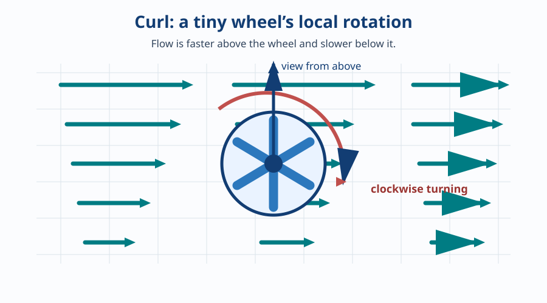
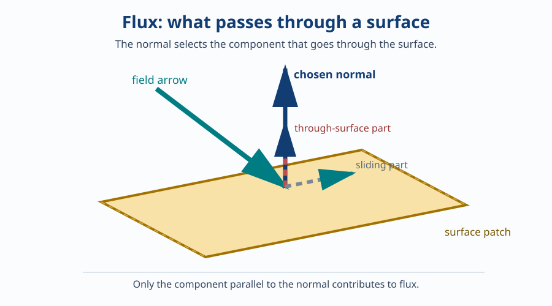
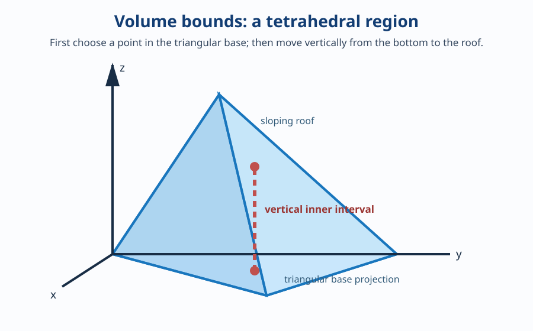

# Curl, Surface Integrals, and Volume Integrals

This is the reusable new material for 2024 Q2. It deliberately does **not** re-teach ideas that already have their own notes. Read the prerequisite sections below first, then return here.

## Before this note: exact prerequisites

| You need to know | Read this exact place first | Why it is needed here |
| --- | --- | --- |
| Vector components and the dot product | [Vectors and planes, sections 1–2](vectors-and-planes.md#1-vectors-direction-and-magnitude) | Curl and flux use vectors; flux uses a dot product. |
| What a scalar field and a vector field are | [Scalar fields, gradients, and potentials, section 1](scalar-fields-gradient-and-potential.md#1-scalar-field-versus-vector-field) | Curl starts with a vector field. |
| Partial derivatives | [Differentiation and integration quick reference, “Partial derivatives and gradient”](differentiation-and-integration-reference.md#partial-derivatives-and-gradient) | Curl is calculated using partial derivatives. |
| Basic integration and definite-integral limits | [Differentiation and integration quick reference, “Integration” and “Definite integrals”](differentiation-and-integration-reference.md#integration) | Surface and volume integrals add quantities using limits. |

> [!TIP]
> You do not need to memorise those notes before reading this one. You only need to recognise their ideas. If a word below feels unfamiliar, follow its link rather than trying to guess it.

## 1. The map of 2024 Q2

| Part | Plain-language question | New tool introduced here |
| --- | --- | --- |
| Q2(a) | How much of the field’s local turning passes through a finite slanted sheet? | Curl, surface flux, and surface parameterization |
| Q2(b) | What is the total local turning throughout a solid under a sloping roof? | Vector triple integral and three-dimensional bounds |

Both parts begin with **curl**. After that, Q2(a) works with a surface and Q2(b) works with a solid.

## 2. Curl: the tiny-paddle-wheel idea

Put a tiny, free-spinning paddle wheel in moving water. If the water pushes every part of it equally, the wheel may travel with the water but it does not turn. If nearby water pushes one side more strongly than the other, the wheel turns.

**Curl** measures that local tendency to turn.

Real-life pictures are a whirlpool in a sink, a small eddy behind a river rock, or wind that moves faster above you than near the ground. Curl is not “how fast the whole flow is moving.” It is specifically the local spinning effect.

> [!IMPORTANT]
> **Exam term — curl**
>
> Curl is a vector that describes the local turning tendency of a vector field. Its direction is the axis about which the imaginary tiny wheel tends to turn.

### Calculating curl

Write the vector field as \(\vec F=P\hat i+Q\hat j+R\hat k\). The letters \(P\), \(Q\), and \(R\) are simply names for its three components. Now use this recipe exactly as written:

> [!IMPORTANT]
> **Exam formula — curl**
>
> \[
> \nabla\times\vec F=
> \left(\frac{\partial R}{\partial y}-\frac{\partial Q}{\partial z}\right)\hat i
> +\left(\frac{\partial P}{\partial z}-\frac{\partial R}{\partial x}\right)\hat j
> +\left(\frac{\partial Q}{\partial x}-\frac{\partial P}{\partial y}\right)\hat k.
> \]

Read \(\nabla\times\vec F\) as “curl of \(\vec F\).” At exam time, do not try to derive this formula; identify \(P,Q,R\), then calculate its three components one at a time.

### Memory aid: the determinant pattern

Yes—the curl formula has the same determinant-style layout used for a cross product. It is a **memory aid** for arranging the components and signs:

> [!IMPORTANT]
> **Exam memory aid — curl determinant layout**
>
> \[
> \nabla\times\vec F=
> \begin{vmatrix}
> \hat i&\hat j&\hat k\\
> \dfrac{\partial}{\partial x}&\dfrac{\partial}{\partial y}&\dfrac{\partial}{\partial z}\\
> P&Q&R
> \end{vmatrix}.
> \]

Read its three rows as: **direction row**, **differentiate row**, **field-component row**.

Expand it exactly as you expand a three-by-three cross-product determinant: use the first column for the \(\hat i\)-part, the second column for the \(\hat j\)-part, and the third column for the \(\hat k\)-part. The signs follow the pattern **plus, minus, plus**:

\[
\begin{aligned}
\nabla\times\vec F
&=\hat i\left(\frac{\partial}{\partial y}R-\frac{\partial}{\partial z}Q\right)
-\hat j\left(\frac{\partial}{\partial x}R-\frac{\partial}{\partial z}P\right)
+\hat k\left(\frac{\partial}{\partial x}Q-\frac{\partial}{\partial y}P\right)\\
&=\left(\frac{\partial R}{\partial y}-\frac{\partial Q}{\partial z}\right)\hat i
+\left(\frac{\partial P}{\partial z}-\frac{\partial R}{\partial x}\right)\hat j
+\left(\frac{\partial Q}{\partial x}-\frac{\partial P}{\partial y}\right)\hat k.
\end{aligned}
\]

The middle component is where most sign mistakes happen. Keep its determinant form, with the visible minus sign, until you expand its bracket. Only then rewrite it in the final curl-formula order.

> [!TIP]
> In the first few problems, write the determinant layout every time. After enough repetitions, the component formula becomes easier to recall naturally.

### Small worked example

Let

\[
\vec G=y\hat i+2x\hat j+0\hat k.
\]

Name the components first:

\[
P=y,\qquad Q=2x,\qquad R=0.
\]

Use the curl recipe one component at a time. The partial-derivative rules used here are in the prerequisite quick reference.

\[
\begin{aligned}
\text{\(\hat i\)-component}
&=\frac{\partial R}{\partial y}-\frac{\partial Q}{\partial z}\\
&=\frac{\partial0}{\partial y}-\frac{\partial(2x)}{\partial z}\\
&=0-0\\
&=0,\\[6pt]
\text{\(\hat j\)-component}
&=\frac{\partial P}{\partial z}-\frac{\partial R}{\partial x}\\
&=\frac{\partial y}{\partial z}-\frac{\partial0}{\partial x}\\
&=0-0\\
&=0,\\[6pt]
\text{\(\hat k\)-component}
&=\frac{\partial Q}{\partial x}-\frac{\partial P}{\partial y}\\
&=\frac{\partial(2x)}{\partial x}-\frac{\partial y}{\partial y}\\
&=2-1\\
&=1.
\end{aligned}
\]

Thus

\[
\nabla\times\vec G=0\hat i+0\hat j+1\hat k=\hat k.
\]

The result points along the positive \(z\)-axis. That means the local turning is around a vertical axis.

> [!TIP]
> **Reliable curl workflow:** name \(P,Q,R\); calculate the \(\hat i\)-component, then the \(\hat j\)-component, then the \(\hat k\)-component; combine the answers only at the end. This prevents sign errors.

## 3. Surface flux: what passes through a sheet

A **surface** is a sheet in space: a window, a net in a river, or a finite piece of a plane. The familiar normal vector from the vectors-and-planes note is extended here: it points straight through the sheet.

Imagine rain at a window. Rain moving through the window contributes to the total passing through it. Rain moving along the glass does not. **Flux** is this “through the sheet” amount.

The dot product keeps only the part of the field pointing in the chosen normal direction. The double integral adds that contribution from every tiny patch of the whole surface.

> [!IMPORTANT]
> **Exam formula — flux through an oriented surface**
>
> \[
> \iint_S\vec C\cdot\hat n\,dS.
> \]
>
> \(S\) is the entire surface; \(\vec C\) is the field; \(\hat n\) is a unit normal; and \(dS\) is one tiny area patch. The two integral signs mean “add over the full surface.”

### A scalar field times a surface normal

Sometimes the question gives a scalar field \(\phi\), rather than a vector field, and asks for

\[
\iint_S\phi\hat n\,dS.
\]

This is a different kind of surface integral from flux, even though both use the same surface and normal. The key is that a scalar can multiply a vector: \(\phi\) supplies a size, and \(\hat n\,dS\) supplies a direction and a tiny area. Their product is a tiny **vector**:

\[
\phi\hat n\,dS.
\]

Imagine pressure acting on a curved sheet. At one tiny patch, the pressure magnitude is a scalar number. The sheet tells the pressure which way to push: straight out along its normal. The tiny force-like contribution is therefore “pressure \(\times\) normal direction \(\times\) tiny area.” Adding those little pushes gives one resultant vector. This is the same mathematical pattern as \(\iint_S\phi\hat n\,dS\).

Do not confuse the three surface integrals below:

| What is given at each patch? | Integral | What is added | Result |
| --- | --- | --- | --- |
| A scalar weight, such as coating density | \(\iint_S\phi\,dS\) | scalar amount \(\phi\,dS\) | scalar |
| A vector field, such as wind velocity | \(\iint_S\vec F\cdot\hat n\,dS\) | only the through-sheet part of \(\vec F\) | scalar flux |
| A scalar strength plus the normal direction | \(\iint_S\phi\hat n\,dS\) | vector amount \(\phi\hat n\,dS\) | vector |

The middle case has a **dot product**, so it extracts one number from a vector field. The third case has **no dot product**: there is no vector field whose through-sheet component needs to be selected. Instead, the normal itself turns the scalar weight into a vector.

> [!IMPORTANT]
> **Exam formula — scalar-weighted oriented surface integral**
>
> \[
> \iint_S\phi\hat n\,dS
> =\iint_D\phi(\vec r(u,v))\bigl(\vec r_u\times\vec r_v\bigr)\,du\,dv.
> \]

The cross product \(\vec r_u\times\vec r_v\) already equals \(\hat n\,dS\): it is the oriented tiny area vector. So the method is simply:

1. parameterize the surface;
2. choose an orientation by choosing the order of the cross product;
3. substitute the surface point into the scalar \(\phi\);
4. multiply the scalar by that oriented area vector; and
5. integrate its three components.

For 2023 Q3(a), the plane produces the constant upward area vector \(\langle1,\tfrac12,1\rangle dx\,dy\). The scalar \(\phi\) becomes \(6x+4y-6\) on that plane. Thus each tiny patch contributes

\[
(6x+4y-6)\left\langle1,\frac12,1\right\rangle dx\,dy.
\]

That is why the final answer is a vector. Reversing the chosen orientation reverses every tiny vector and hence reverses the final vector.

### Orientation: which side is positive?

Every sheet has two sides. Selecting one normal selects the positive direction. For a horizontal surface, “upward” means a normal with positive \(z\)-component; “downward” means the opposite normal.

> [!IMPORTANT]
> **Exam fact — changing orientation**
>
> Replacing \(\hat n\) by \(-\hat n\) changes a flux integral’s sign. Nothing else in the calculation changes.

This matters in Q2(a): the paper does not state an orientation. The study guide uses the standard upward orientation and explicitly gives the downward alternative.

## 4. Parameterizing a surface: giving every point on a sheet an address

To integrate over a surface, we need a systematic way to visit every point on it. A **parameterization** does that. For a plane that can be written as \(z=f(x,y)\), use \(x\) and \(y\) as the two inputs and let the plane equation supply the height \(z\).

> [!IMPORTANT]
> **Exam formula — parameterizing a graph-like plane**
>
> \[
> z=f(x,y)
> \quad\Longrightarrow\quad
> \vec r(x,y)=\langle x,y,f(x,y)\rangle.
> \]

For the Q2(a) plane, solve the equation for \(z\):

\[
\begin{aligned}
2x+y+2z&=6,\\
2z&=6-2x-y,\\
z&=\frac{6-2x-y}{2},\\
z&=3-x-\frac y2.
\end{aligned}
\]

Therefore the surface address is

\[
\vec r(x,y)=\left\langle x,y,3-x-\frac y2\right\rangle.
\]

This statement only means: choose \(x\) and \(y\), then use the plane’s rule to find the matching height.

### From two surface directions to a normal

Changing \(x\) while keeping \(y\) fixed gives one tangent vector, \(\vec r_x\). Changing \(y\) while keeping \(x\) fixed gives another, \(\vec r_y\). Both lie along the surface.

\[
\begin{aligned}
\vec r_x
&=\left\langle\frac{\partial x}{\partial x},\frac{\partial y}{\partial x},\frac{\partial(3-x-y/2)}{\partial x}\right\rangle\\
&=\langle1,0,-1\rangle,\\[6pt]
\vec r_y
&=\left\langle\frac{\partial x}{\partial y},\frac{\partial y}{\partial y},\frac{\partial(3-x-y/2)}{\partial y}\right\rangle\\
&=\left\langle0,1,-\frac12\right\rangle.
\end{aligned}
\]

The cross product gives a vector perpendicular to both tangent vectors, so it gives a normal to the plane.

> [!IMPORTANT]
> **Exam formula — cross product in components**
>
> \[
> \langle a,b,c\rangle\times\langle p,q,r\rangle
> =\langle br-cq,\;cp-ar,\;aq-bp\rangle.
> \]

For the Q2(a) tangents:

\[
\begin{aligned}
\vec r_x\times\vec r_y
&=\left\langle1,0,-1\right\rangle\times\left\langle0,1,-\frac12\right\rangle\\
&=\left\langle0\left(-\frac12\right)-(-1)(1),\;(-1)(0)-1\left(-\frac12\right),\;1(1)-0(0)\right\rangle\\
&=\left\langle0+1,\;0+\frac12,\;1-0\right\rangle\\
&=\left\langle1,\frac12,1\right\rangle.
\end{aligned}
\]

Its third component is positive, so this is the upward orientation. Reversing the cross-product order reverses the normal.

The cross product does two jobs: it points normal to the surface and its length gives the area scaling for the tiny slanted patch. This leads directly to the calculation form of flux:

> [!IMPORTANT]
> **Exam formula — parameterized surface flux**
>
> \[
> \iint_S\vec C\cdot\hat n\,dS
> =\iint_D\vec C(\vec r(x,y))\cdot(\vec r_x\times\vec r_y)\,dx\,dy.
> \]
>
> \(D\) is the allowed region of the parameters. In Q2(a), the given limits make \(D\) a rectangle.

## 5. Triple integrals: adding throughout a solid

An ordinary integral adds along a line. A double integral adds over a sheet. A **triple integral** adds throughout a three-dimensional solid.

Picture a solid object made of extremely tiny boxes. A triple integral adds the contribution from every tiny box.

> [!IMPORTANT]
> **Exam term — \(dV\)**
>
> \(dV\) means one tiny volume. In \(dz\,dy\,dx\), integrate vertically first, then move through \(y\), then move through \(x\).

If the quantity being added is a vector, add its three components separately.

> [!IMPORTANT]
> **Exam formula — triple integral of a vector field**
>
> \[
> \iiint_V\langle A,B,C\rangle\,dV
> =\left\langle\iiint_VA\,dV,\;\iiint_VB\,dV,\;\iiint_VC\,dV\right\rangle.
> \]

The final result is a vector because the input was a vector.

## 6. Reading the bounds of the Q2(b) solid

The coordinate planes \(x=0\), \(y=0\), and \(z=0\) form two walls and a floor. The plane \(2x+2y+z=4\) is the sloping roof. Together they enclose a pyramid-like solid called a **tetrahedron**.

Choose the integration order \(dz\,dy\,dx\). Start with \(z\), so first find the roof height:

\[
\begin{aligned}
2x+2y+z&=4,\\
z&=4-2x-2y.
\end{aligned}
\]

At a fixed base location \((x,y)\), move vertically from the floor to the roof:

\[
0\le z\le4-2x-2y.
\]

For the roof to be above the floor, its height must not be negative:

\[
\begin{aligned}
4-2x-2y&\ge0,\\
4&\ge2x+2y,\\
2&\ge x+y,\\
y&\le2-x.
\end{aligned}
\]

The two walls give \(x\ge0\) and \(y\ge0\). The base is therefore a triangle. Taking \(x\) as the outer variable gives \(0\le x\le2\); after choosing \(x\), \(y\) runs from 0 to \(2-x\).

### Why the limits depend on each other

Do not read \(0\le y\le2-x\) as a formula to memorise. It is a sentence about a moving slice. With \(x\) fixed, the vertical slice of the triangular base starts at the wall \(y=0\) and ends at the slanted base edge \(x+y=2\), which rearranges to \(y=2-x\). For example, when \(x=\tfrac12\), \(y\) may run only from 0 to \(\tfrac32\), not to 2.

Likewise, after choosing both \(x\) and \(y\), the roof height is \(4-2x-2y\), so the allowed vertical segment is \(0\le z\le4-2x-2y\). At \((x,y)=(\tfrac12,1)\), the roof height is \(4-1-2=1\), hence \(0\le z\le1\). A sloping roof must produce an upper height that changes with the horizontal location.

Read the nested integral from outside inward: choose \(x\), then an allowed \(y\) at that \(x\), then every allowed height \(z\) above that base point. This is exactly how the integral visits every tiny box in the solid once.

> [!IMPORTANT]
> **Exam formula — Q2(b) bounds in the order \(dz\,dy\,dx\)**
>
> \[
> 0\le x\le2,\qquad
> 0\le y\le2-x,\qquad
> 0\le z\le4-2x-2y.
> \]

Use this same set of bounds separately for each component of the curl in Q2(b).

## 7. Start the worked guide

You are ready for [2024 Q2 study guide](../2024/q2-study-guide.md) when you can state these ideas:

1. Curl is local turning, like a tiny paddle wheel.
2. Flux is what passes through a surface, and the chosen normal decides its sign.
3. Parameterizing a surface gives each point on it two input values.
4. A triple integral adds through a solid, and vector components are integrated separately.

> [!TIP]
> Use this note for the new ideas; use the linked prerequisite notes whenever you need the earlier ideas again. That keeps each topic in one reliable place.
