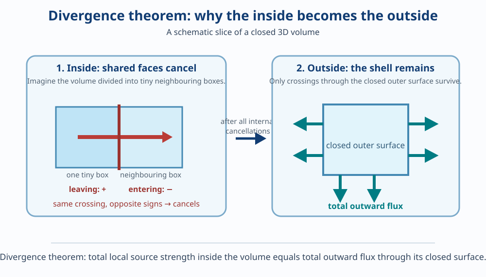

# Divergence Theorem and Stokes’ Theorem

This note adds the new ideas for 2024 Q3. It does not repeat curl, flux, normals, or line integrals. Use these existing notes whenever those foundations need a refresh:

- [Curl, surface integrals, and volume integrals](curl-surface-and-volume-integrals.md)
- [Line integrals](line-integrals.md)
- [Vectors and planes](vectors-and-planes.md)

## 1. The two big ideas

Both theorems turn a difficult integral into a related integral over a different shape.

| Theorem | Shape you start with | What it relates | Physical picture |
| --- | --- | --- | --- |
| Divergence theorem | A **closed surface** surrounding a solid | Outward flux through the shell and divergence inside the solid | Air escaping or entering a balloon |
| Stokes’ theorem | An **open surface** with an edge | Circulation around the edge and curl passing through the surface | Water going around a loop and a tiny paddle wheel inside it |

## 2. Divergence: source strength at one point

Imagine a very tiny balloon around one location in a vector field. Compare all fluid entering through its skin with all fluid leaving through its skin:

- if more leaves than enters, fluid must be added somewhere inside the balloon. The location behaves mathematically like a **source**: it supplies fluid to its surroundings;
- if more enters than leaves, fluid must be removed somewhere inside the balloon. The location behaves mathematically like a **sink**: it takes fluid out of its surroundings;
- if the two amounts are equal, there is no net addition or removal inside the balloon.

The “source” or “sink” is not necessarily a literal tiny object sitting at a mathematical point. It describes the local balance the vector field behaves **as if** it has. **Divergence** measures this net outward tendency per unit volume.

> [!IMPORTANT]
> **Exam term — divergence**
>
> The divergence of a vector field is a scalar. Positive divergence means net local outflow; negative divergence means net local inflow; zero divergence means no net local creation or loss.

For \(\vec F=P\hat i+Q\hat j+R\hat k\), calculate it by adding the rate of change of each component in its own direction:

> [!IMPORTANT]
> **Exam formula — divergence**
>
> \[
> \nabla\cdot\vec F
> =\frac{\partial P}{\partial x}
> +\frac{\partial Q}{\partial y}
> +\frac{\partial R}{\partial z}.
> \]

The symbol \(\nabla\cdot\vec F\) is read “divergence of \(\vec F\).” Notice the dot, not the cross: divergence produces one number, while curl produces a vector.

### Small example

Let \(\vec F=x\hat i+y\hat j+z\hat k\). Then

\[
\begin{aligned}
\nabla\cdot\vec F
&=\frac{\partial x}{\partial x}+\frac{\partial y}{\partial y}+\frac{\partial z}{\partial z}\\
&=1+1+1\\
&=3.
\end{aligned}
\]

The positive result matches the picture: every arrow points away from the origin and gets larger farther out, so a tiny balloon has net outflow.

### Why the divergence formula measures net outward flow

This is the useful derivation in your teacher’s note. Take a tiny rectangular box centred at \((x,y,z)\), with side lengths \(\Delta x\), \(\Delta y\), and \(\Delta z\). Let \(P\) be the field’s \(x\)-component at the centre.

On the left \(x\)-face, the \(x\)-component is approximately

\[
P-\frac12\frac{\partial P}{\partial x}\Delta x.
\]

On the right \(x\)-face, it is approximately

\[
P+\frac12\frac{\partial P}{\partial x}\Delta x.
\]

These are first-order approximations: move half the box width left or right from the centre, and use the partial derivative to estimate the change in \(P\).

The right face has outward normal in the positive \(x\)-direction. The left face has outward normal in the negative \(x\)-direction. Therefore, the net **outward** flow through the two \(x\)-faces is right-face flow minus left-face flow:

\[
\begin{aligned}
\Phi_x
&=\left(P+\frac12\frac{\partial P}{\partial x}\Delta x\right)\Delta y\Delta z
-\left(P-\frac12\frac{\partial P}{\partial x}\Delta x\right)\Delta y\Delta z\\
&=\left[P+\frac12\frac{\partial P}{\partial x}\Delta x-P+\frac12\frac{\partial P}{\partial x}\Delta x\right]\Delta y\Delta z\\
&=\frac{\partial P}{\partial x}\Delta x\Delta y\Delta z.
\end{aligned}
\]

For the \(y\)-faces, use the centre approximations \(Q-\tfrac12(\partial Q/\partial y)\Delta y\) on the lower-\(y\) face and \(Q+\tfrac12(\partial Q/\partial y)\Delta y\) on the upper-\(y\) face:

\[
\begin{aligned}
\Phi_y
&=\left(Q+\frac12\frac{\partial Q}{\partial y}\Delta y\right)\Delta x\Delta z
-\left(Q-\frac12\frac{\partial Q}{\partial y}\Delta y\right)\Delta x\Delta z\\
&=\left[Q+\frac12\frac{\partial Q}{\partial y}\Delta y-Q+\frac12\frac{\partial Q}{\partial y}\Delta y\right]\Delta x\Delta z\\
&=\frac{\partial Q}{\partial y}\Delta x\Delta y\Delta z.
\end{aligned}
\]

For the \(z\)-faces, use the centre approximations \(R-\tfrac12(\partial R/\partial z)\Delta z\) on the lower-\(z\) face and \(R+\tfrac12(\partial R/\partial z)\Delta z\) on the upper-\(z\) face:

\[
\begin{aligned}
\Phi_z
&=\left(R+\frac12\frac{\partial R}{\partial z}\Delta z\right)\Delta x\Delta y
-\left(R-\frac12\frac{\partial R}{\partial z}\Delta z\right)\Delta x\Delta y\\
&=\left[R+\frac12\frac{\partial R}{\partial z}\Delta z-R+\frac12\frac{\partial R}{\partial z}\Delta z\right]\Delta x\Delta y\\
&=\frac{\partial R}{\partial z}\Delta x\Delta y\Delta z.
\end{aligned}
\]

Add the three outward flows, then divide by the tiny box’s volume \(\Delta x\Delta y\Delta z\):

\[
\begin{aligned}
\frac{\Phi_x+\Phi_y+\Phi_z}{\Delta x\Delta y\Delta z}
&=\frac{\partial P}{\partial x}+\frac{\partial Q}{\partial y}+\frac{\partial R}{\partial z}\\
&=\nabla\cdot\vec F.
\end{aligned}
\]

So divergence is net **outward** flow per unit volume. Be careful with the word “gain”: the fluid retained inside the box is inward flow minus outward flow, so it has the opposite sign. The teacher’s note has the right component derivation, but its use of “gain” can blur that sign distinction.

## 3. Closed surfaces and the divergence theorem

A **closed surface** completely encloses a volume: the skin of a ball, all six faces of a box, or the complete outer shell of a tetrahedron. It has no boundary edge.

The outward normal is the normal pointing away from the enclosed solid. It sets the positive direction for flux.

*Picture the box as being cut into tiny boxes. At every shared internal face, one tiny box counts flow as leaving while its neighbour counts the same flow as entering. Those two contributions cancel. The arrows crossing the outside shell are the ones that remain.*

> [!IMPORTANT]
> **Exam theorem — divergence theorem**
>
> If \(S\) is a closed, piecewise smooth surface enclosing a volume \(V\), and \(\vec F=P\hat i+Q\hat j+R\hat k\) has continuous first partial derivatives on and inside \(S\), then
>
> \[
> \iint_S\vec F\cdot\hat n\,dS
> =\iiint_V(\nabla\cdot\vec F)\,dV.
> \]

The left side adds flow passing outward through the whole shell. The right side adds the local source strength throughout the inside. The theorem says these are the same total quantity.

### Proof idea, then the exam proof

Cut the solid into many tiny boxes. A shared internal face is outward for one box but inward for the adjacent box, so its two flux contributions cancel. Only the outer faces remain. This is why a total inside effect becomes flux through the outside shell.

For the calculation proof, first use a rectangular box:

\[
V=[a,b]\times[c,d]\times[e,f].
\]

The two faces perpendicular to the \(x\)-axis have outward normals \(+\hat i\) and \(-\hat i\). Their combined outward flux is

\[
\begin{aligned}
\Phi_x
&=\int_e^f\int_c^dP(b,y,z)\,dy\,dz
-\int_e^f\int_c^dP(a,y,z)\,dy\,dz\\
&=\int_e^f\int_c^d\big[P(b,y,z)-P(a,y,z)\big]dy\,dz\\
&=\int_e^f\int_c^d\left[\int_a^b\frac{\partial P}{\partial x}\,dx\right]dy\,dz
&&\text{[Fundamental Theorem of Calculus: \(\int_a^b f'(x)\,dx=f(b)-f(a)\)]}\\
&=\iiint_V\frac{\partial P}{\partial x}\,dV.
\end{aligned}
\]

For the two faces perpendicular to the \(y\)-axis, the outward normals are \(+\hat j\) and \(-\hat j\). Their combined flux is

\[
\begin{aligned}
\Phi_y
&=\int_e^f\int_a^bQ(x,d,z)\,dx\,dz
-\int_e^f\int_a^bQ(x,c,z)\,dx\,dz\\
&=\int_e^f\int_a^b\big[Q(x,d,z)-Q(x,c,z)\big]dx\,dz\\
&=\int_e^f\int_a^b\left[\int_c^d\frac{\partial Q}{\partial y}\,dy\right]dx\,dz
&&\text{[Fundamental Theorem of Calculus: \(\int_c^d f'(y)\,dy=f(d)-f(c)\)]}\\
&=\iiint_V\frac{\partial Q}{\partial y}\,dV.
\end{aligned}
\]

For the two faces perpendicular to the \(z\)-axis, the outward normals are \(+\hat k\) and \(-\hat k\). Their combined flux is

\[
\begin{aligned}
\Phi_z
&=\int_c^d\int_a^bR(x,y,f)\,dx\,dy
-\int_c^d\int_a^bR(x,y,e)\,dx\,dy\\
&=\int_c^d\int_a^b\big[R(x,y,f)-R(x,y,e)\big]dx\,dy\\
&=\int_c^d\int_a^b\left[\int_e^f\frac{\partial R}{\partial z}\,dz\right]dx\,dy
&&\text{[Fundamental Theorem of Calculus: \(\int_e^f G'(z)\,dz=G(f)-G(e)\)]}\\
&=\iiint_V\frac{\partial R}{\partial z}\,dV.
\end{aligned}
\]

Add the three fluxes:

\[
\begin{aligned}
\iint_S\vec F\cdot\hat n\,dS
&=\Phi_x+\Phi_y+\Phi_z\\
&=\iiint_V\frac{\partial P}{\partial x}\,dV
+\iiint_V\frac{\partial Q}{\partial y}\,dV
+\iiint_V\frac{\partial R}{\partial z}\,dV\\
&=\iiint_V\left(\frac{\partial P}{\partial x}+\frac{\partial Q}{\partial y}+\frac{\partial R}{\partial z}\right)dV\\
&=\iiint_V(\nabla\cdot\vec F)\,dV.
\end{aligned}
\]

For a general smooth solid, approximate it by many tiny boxes. The fluxes on shared internal faces cancel, as described above; in the limit, the same equality holds. This completes the proof.

## 4. Open surfaces, boundaries, and Stokes’ theorem

An **open surface** has an edge, called its **boundary curve**. A soap film stretched across a wire loop is an open surface; the wire loop is its boundary.

Stokes’ theorem says that two different measurements describe the same turning:

- walk once around the boundary and measure how much the field helps that walk (a line integral);
- measure curl passing through the surface spanning that boundary (a surface integral).

> [!IMPORTANT]
> **Exam theorem — Stokes’ theorem**
>
> If \(S\) is an oriented smooth surface with boundary \(C\), and \(\vec F\) has continuous first partial derivatives, then
>
> \[
> \oint_C\vec F\cdot d\vec r
> =\iint_S(\nabla\times\vec F)\cdot\hat n\,dS.
> \]

The circle on the integral sign means that \(C\) is closed: the route ends where it started.

### Orientation is not optional

The direction around \(C\) and the chosen normal must agree. Use the right-hand rule: point your right thumb along \(\hat n\); your curled fingers show the positive direction around the boundary.

Changing both the normal and boundary direction leaves both sides unchanged. Changing only one reverses one side and breaks the equality.

For the 2024 Q3(b) missing face, the compatible pair used in the guide is normal \(+\hat j\) and boundary direction \(O\to B\to A\to O\). The reverse route \(O\to A\to B\to O\) is equally valid only with normal \(-\hat j\).

## 5. The shortcut when a surface has a difficult shape

Stokes’ theorem depends only on the boundary curve \(C\), not on the particular spanning surface chosen. If two surfaces have the same boundary and compatible orientation, either surface gives the same answer.

This is the key to 2024 Q3(b). The given surface consists of all faces of a tetrahedron **except** the face in the \(xz\)-plane. The missing face is \(y=0\). Its triangular edge is the boundary curve of the remaining surface.

Instead of integrating curl over the three remaining faces, use the simple missing triangular face as the spanning surface. To match the boundary orientation induced by the remaining outward-facing surfaces, choose the normal on the missing face toward positive \(y\).

> [!TIP]
> In a verification question, calculate both sides of Stokes’ theorem. You may use the easiest surface with the same boundary to calculate the surface side, but the boundary direction and normal must remain compatible.

## 6. 2024 Q3 checklist

For 2024 Q3(a): state all hypotheses; state the theorem; prove it first for a rectangular box by pairing opposite faces; explain cancellation of internal faces for a general solid.

For 2024 Q3(b): identify the omitted face; draw its triangular boundary; choose compatible orientation; calculate curl; calculate the line integral around all three edges; calculate the curl flux through the simple triangle; compare the two results.
