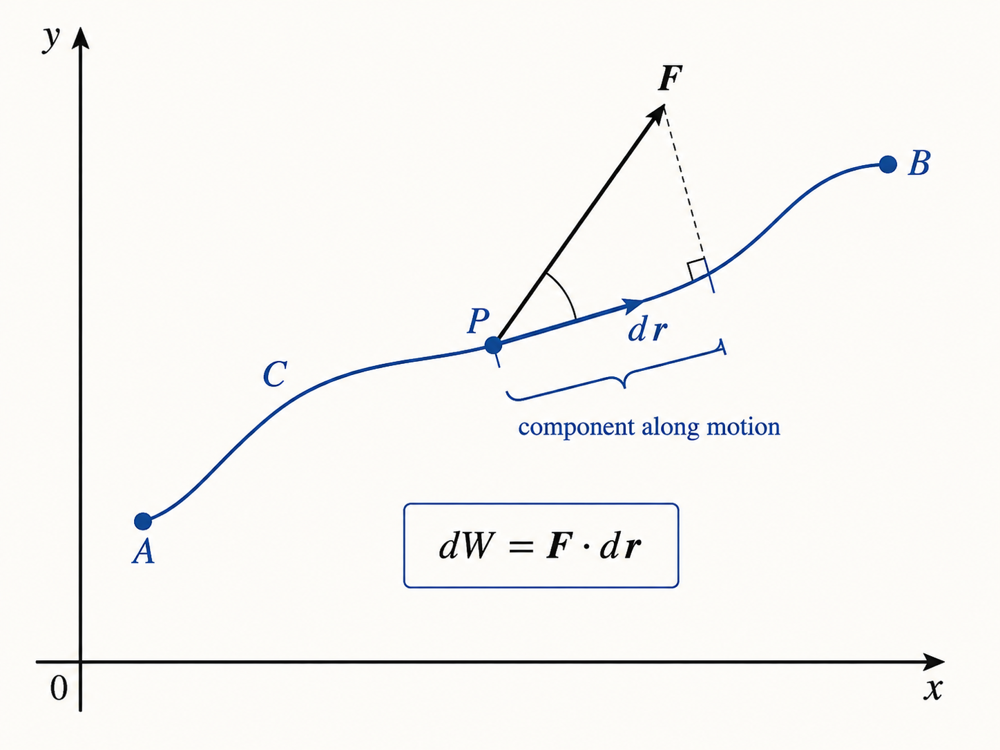

# Line Integrals of Vector Fields

## Before you begin: the missing building blocks

Read this note in this order. A line integral combines all four ideas below.

1. A **vector** is an arrow with direction and size: \(\langle a,b,c\rangle\).
2. A **vector field** puts a different arrow at each location. For example, wind velocity or force is a vector field.
3. A **curve** is a route through space. A parameterization \(\vec r(t)\) tells us where the moving particle is at time \(t\).
4. The **dot product** measures the part of one arrow acting in another arrow's direction.

The vector basics are in [Vectors and Planes](vectors-and-planes.md), and derivative/integral rules are in the [Quick Reference](differentiation-and-integration-reference.md).

### 1. Dot product: why it appears

For two vectors \(\vec u=\langle u_1,u_2,u_3\rangle\) and \(\vec v=\langle v_1,v_2,v_3\rangle\),

\[
\vec u\cdot\vec v=u_1v_1+u_2v_2+u_3v_3
=|\vec u|\,|\vec v|\cos\alpha.
\]

The second form is the meaning: \(\alpha\) is the angle between the arrows. If the arrows point in the same direction, the dot product is positive; if they are perpendicular, it is zero; if opposite, it is negative. That is exactly what “a force helps, does nothing, or resists motion” means.

### 2. Curve, position, and displacement

Think of \(\vec r(t)\) as the particle's GPS position. For example,

\[
\vec r(t)=\langle t,t^2,0\rangle
\]

means that at time \(t=2\), the particle is at \((2,4,0)\). Its velocity is

\[
\vec r\,'(t)=\langle1,2t,0\rangle.
\]

In a tiny time \(dt\), it moves by \(d\vec r=\vec r\,'(t)dt\). This small displacement points **along the curve**, which is why it is called a tangent displacement.

### 3. From one tiny step to the whole trip

At one position, calculate tiny work as \(dW=\vec F\cdot d\vec r\). The line integral simply adds all these tiny values from the start of the route to the end. Nothing new is being invented by the integral: it is a continuous version of adding many small numbers.

## 1. What \(\int_C\vec F\cdot d\vec r\) means

A line integral adds the component of a vector field tangent to a path. In mechanics, it is the work done by a force \(\vec F\) as an object travels along \(C\).

If the path is parameterized by

\[
\vec r(t)=\langle x(t),y(t),z(t)\rangle,\qquad a\le t\le b,
\]

then

\[
d\vec r=\vec r\,'(t)dt
\]

and

> [!IMPORTANT]
> **Exam formula — vector line integral**

\[
\int_C\vec F\cdot d\vec r=
\int_a^b\vec F(\vec r(t))\cdot\vec r\,'(t)\,dt.
\]

## 2. The reliable workflow

1. Parameterize the path in the stated direction.
2. Find \(d\vec r\), or \(dx,dy,dz\).
3. Substitute the parameterization into the field.
4. Take the dot product.
5. Integrate using limits that match the direction.

For \(\vec F=P\hat i+Q\hat j+R\hat k\), an equivalent form is

> [!IMPORTANT]
> **Exam formula — component form**

\[
\int_C P\,dx+Q\,dy+R\,dz.
\]

## 3. A circle in the plane \(z=1\)

The circle \(x^2+y^2=1, z=1\) can be written as

> [!IMPORTANT]
> **Exam formula — unit circle at height \(z=1\)**

\[
x=\cos\theta,\qquad y=\sin\theta,\qquad z=1.
\]

Then

\[
dx=-\sin\theta\,d\theta,\qquad dy=\cos\theta\,d\theta,\qquad dz=0.
\]

The endpoint \((0,1,1)\) corresponds to \(\theta=\pi/2\); \((1,0,1)\) corresponds to \(\theta=0\). Therefore the stated trip uses \(\theta:\pi/2\to0\). Reversing these limits reverses the sign of the line integral.

## 4. Small example

Let \(\vec F=y\hat i+x\hat j\), and follow the quarter circle from \((1,0)\) to \((0,1)\). With \(x=\cos\theta,y=\sin\theta\), \(0\le\theta\le\pi/2\),

\[
\vec F\cdot d\vec r=y\,dx+x\,dy
=\sin\theta(-\sin\theta)d\theta+\cos\theta(\cos\theta)d\theta.
\]

The integrand is \(\cos^2\theta-\sin^2\theta\). The key lesson is not the final number: the parameter bounds encode the travel direction.

## 5. Common mistakes

- Forgetting that \(dz=0\) when \(z\) is constant.
- Substituting into \(\vec F\) but not into \(dx,dy,dz\).
- Using counter-clockwise bounds when the endpoints specify clockwise travel.
